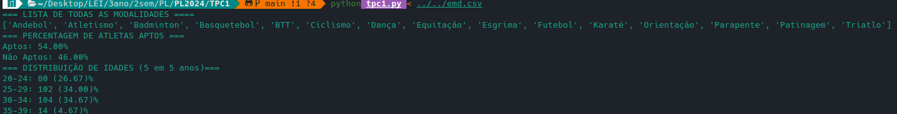

# TPC1

### Descrição do problema

Para este problema, é forncedido um ficheiro csv com dados, os quais vão ser extraidos, guardados em memória e imprimir no ecrã os seguintes resultados:


* Lista ordenada alfabeticamente das modalidades desportivas;
* Percentagens de atletas aptos e inaptos para a prática desportiva;
* Distribuição de atletas por escalão etário (escalão = intervalo de 5 anos): ... [30-34], [35-39], ...

## Solução do problema

### Estruturas de dados
Antes mesmo de começar a escrever o código para o problema comecei por pensar que tipo de estruturas iam ser necessárias para guardar os dados necessários em memória, logo comecei por criar uma classe **Athlete** para guardar as informações de cada atleta e um dicionário (**athletes**) onde vamos guardar cada um dos atletas, tendo como chave o seu id.


### Leitura de dados 
De modo a extrair os dados do csv, recebemos este como input do programa, de modo a que a execução do programa seja :
```zsh 
python tpc1.py < test.csv
```


Desta forma, guardamos a primeira linha do csv, o header, e procesamos cada uma das restantes linhas tendo esta em conta, criando assim um dicionário para cada onde os pares key values vao corresponder às colunas correspondentes do ficheiro csv. O dicionário de cada linha vai ser então, utilizando para construir uma instância da classe **Athlete** e guardado assim os dados no dicionário **athletes**.


### Primeiro Problema

Para este problema difinimos a função **listSport** que começa por criar um set,de modo a não haver repetição de dados, com todas as modalidas existentes. De seguida passamos o set para uma lista e ordenamos esta tendo em conta o alfabeto.

### Segundo Problema

Para este problema, começo por utilizar a função **percentagemAptos** que percorre todos os atletas e conta quantos são aptos(result = true), com esta informação calula a percentagem de aptos que vai ser utilizada para calcular a percentagem de inpatos uma vez que ***inaptos = 100% -aptos***.

### Terceiro problema

Este problema já encontra uma complexidade acrescida relativamente aos restantes, logo começei por criar uma função principal e outra auxiliar. 

A função auxiliar, **parteIdade**, que recebe a idade de um atleta e determina a faixa etária à qual ele pertence, sendo esta genérica para receber qualquer tipo de partição de idades. 

A função principal **distribuicaoIdades**, tal como a auxiliar esta função também pode ser utilizada para qualquer partição. Esta função começa então por determinar a idade máxima e idade mínima dos atletas, com essa informação criamos um dicionário **dict** onde inicializamos todas as faixas etárias possíveis a 0. Posteriormente, a função precorre todos os atletas e incrementa o valor da faixa etária correspondente a cada um dos mesmos, por fim removo do dicionário todas as faixas etárias que não possuam, pelo menos, um atleta.


## Resultado




